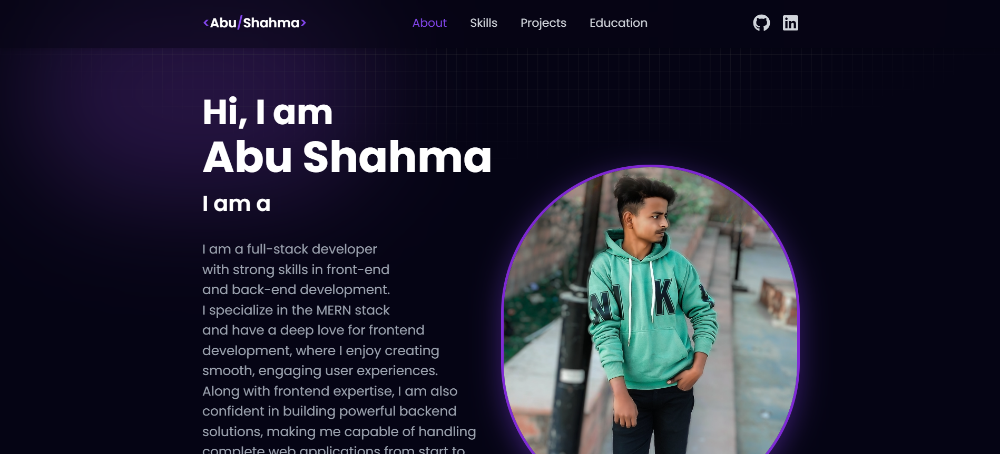
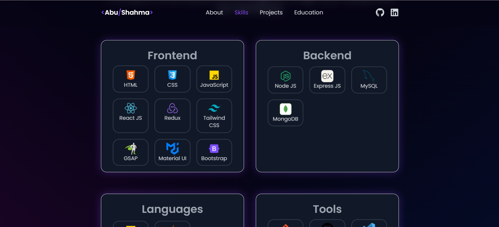
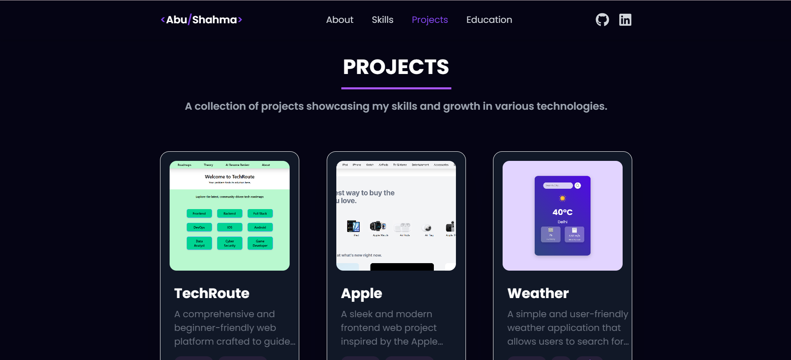
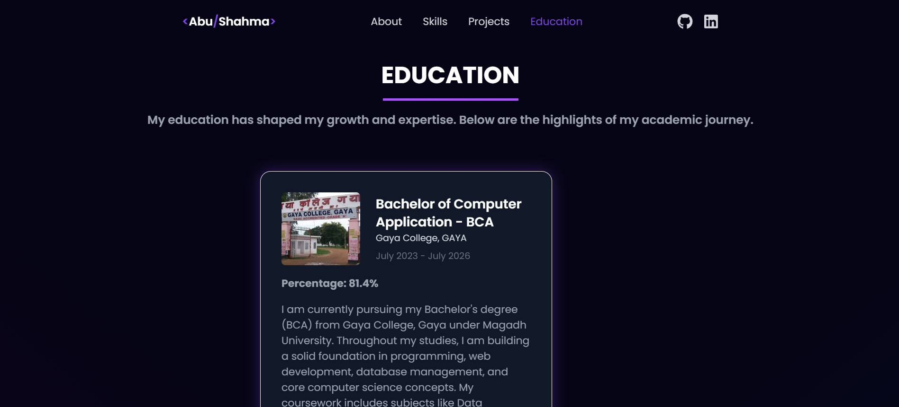
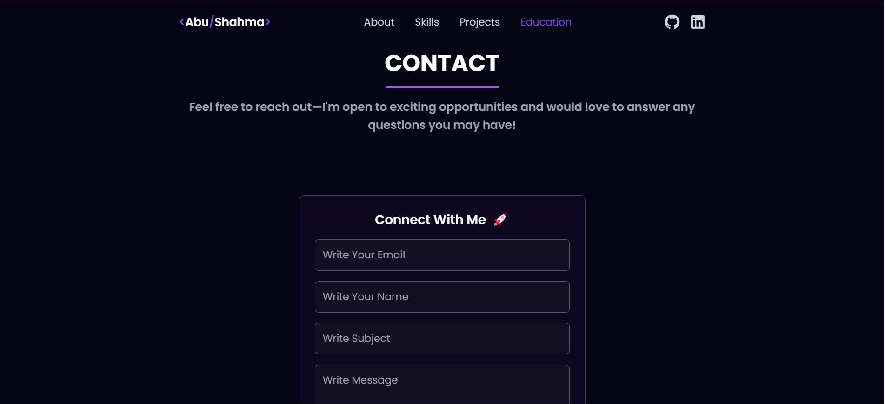
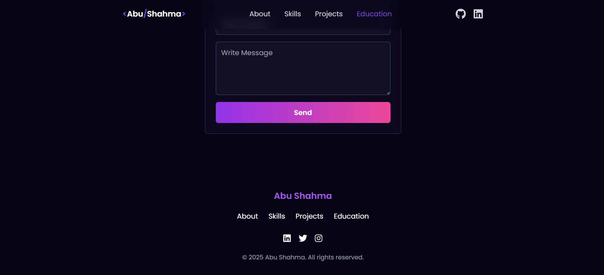

Portfolio Project - Abu Shahma

---

This is my personal portfolio website built using React JS, Tailwind CSS, and other modern technologies. It showcases my skills, projects, and educational background, along with a contact form to get in touch with me.

---

💻 Technologies Used

. React JS: For building the interactive UI.

. React Icons: For adding icons like GitHub, LinkedIn, etc.

. React Toastify: For displaying success/error messages.

. React Typing Effect: For the typing animation in the About section.

. React Parallax Tilt: For adding tilt effects to the profile image and more on.

. EmailJS (emailjs/browser): To send messages from the contact form to my email.

. Tailwind CSS: For styling the components and making the website responsive.

. React Router DOM: For routing between different sections of the portfolio.

---

🚀 Features

1. Navbar

. adding my name in navbar
. Links to various sections: About, Skills, Projects and Education.
. Includes links to my GitHub and LinkedIn profiles.

2. About Section

. Displays a short introduction: "Hi, I'm Abu Shahma".
. Typing effect animation showing my roles: Frontend Developer, Web Developer, MERN Stack Developer and Coder.
. A brief description about me.
. A React Tilt effect on my profile picture.
. A button to view/download my Resume.

3. Skills Section

. Frontend Skills: HTML, CSS, JavaScript, React, Tailwind CSS, Redux, GSAP, Material UI and Bootstrap.
. Backend Skills: Node.js, Express JS, MongoDB, MySQL.
. Languages: JavaScript, and Java.
. Tools: Git, GitHub, VS Code, Postman, Compass, Vercel and Netlify.

4. Projects Section

. A collection of my personal and professional projects.
. Each project includes:
. Image, Title and Description
. Technologies Used
. Buttons to View Code (on GitHub) and View Live (on Vercel).

5. Education Section

. Information about my academic journey:
. Matriculation, Inter, and Currently BCA.
. Details: College name, percentage, location, start date, and descriptions.
. Images from each school/college.

6. Contact Section
. A contact form where users can send me their email, name, subject, and message.
. Uses EmailJS to send the form data directly to my email.

7. Footer
. Similar to the navbar, with links to my LinkedIn, Twitter, and Instagram profiles.

---

## 📸 Project Screenshots

### 📌 Screenshot 1  

### 📌 Screenshot 2

### 📌 Screenshot 3

### 📌 Screenshot 4

### 📌 Screenshot 5

### 📌 Screenshot 6

---

🔧 Setup

1. Clone the repository:
git clone https://github.com/AbuShahma05/Portfolio-Project

2. Install dependencies: Navigate into the project folder and run:
npm install

4. Start the development server:
npm run dev

4. Set up EmailJS:
. Sign up on EmailJS and create a service.
. Follow the instructions to configure the contact form with your EmailJS credentials.

---

